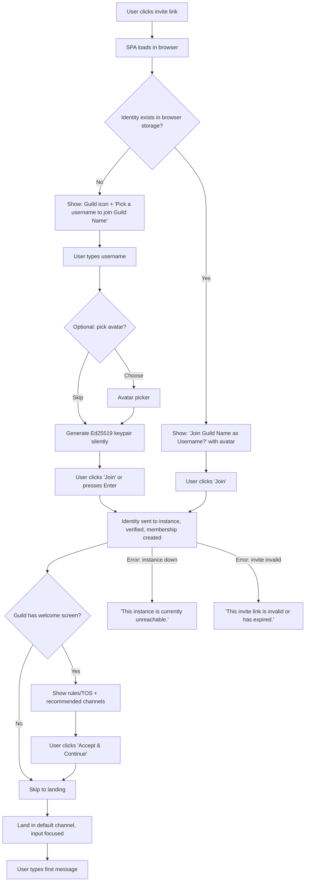
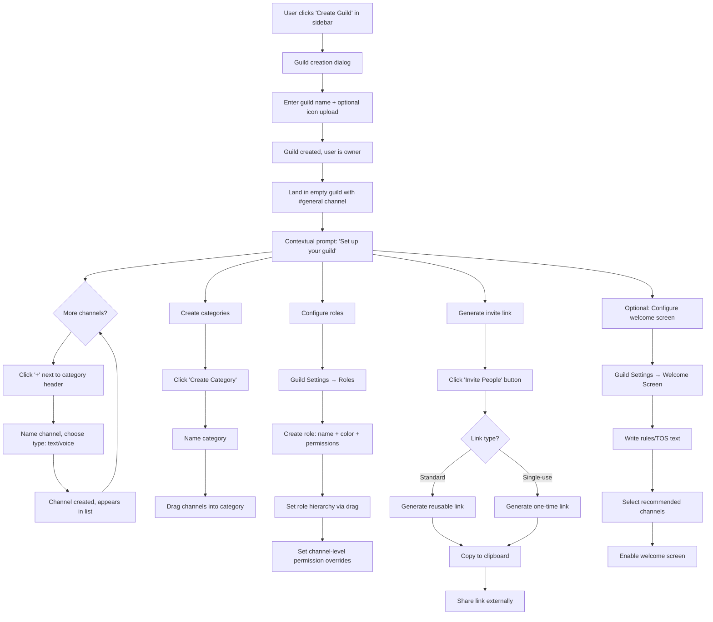
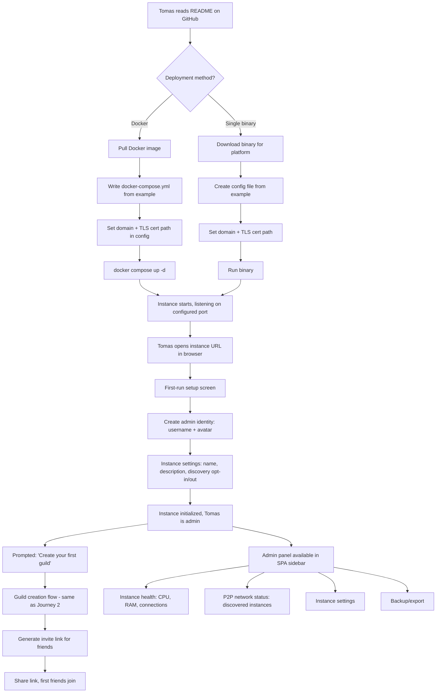
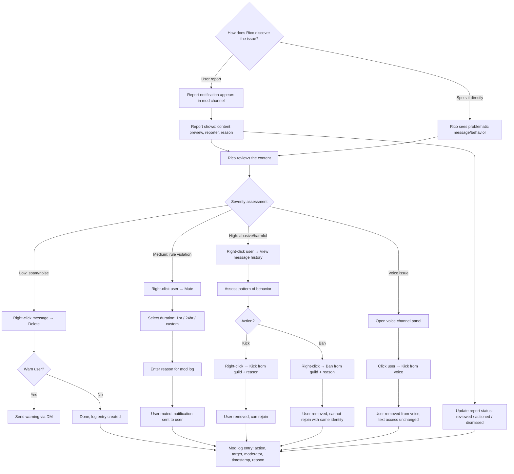
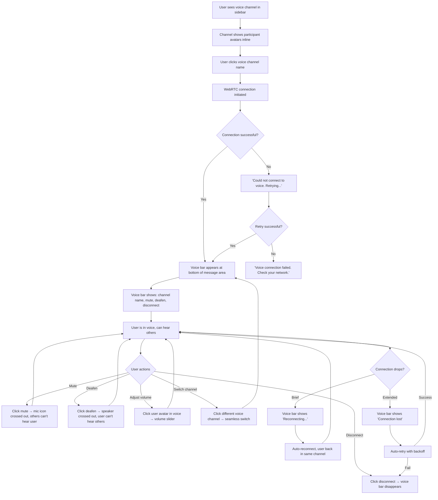
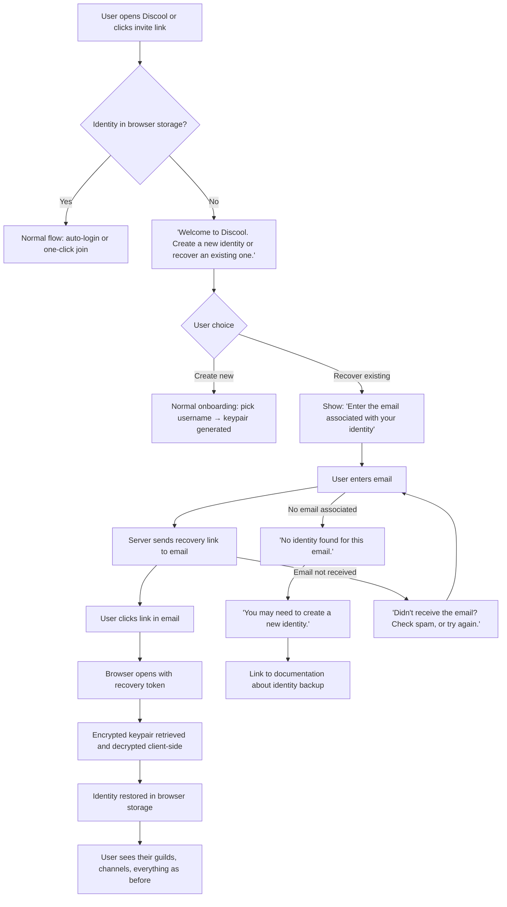

# UX Design Specification - Discool

**Author:** Darko
**Date:** 2026-02-17

---

## Executive Summary

### Project Vision

Discool is a self-hosted, open-source communication platform that combines real-time text chat, voice channels, guilds with role-based permissions, and portable cryptographic identity into a single Svelte 5 SPA backed by a Rust server. Instances discover each other via P2P protocols with no central authority. Moderation is kept at the user and guild level — no instance-level defederation.

The UX must achieve a specific tension: feel immediately familiar to Discord users while solving Discord's structural problems (channel overload, dead-feeling spaces, paywalled features, poor accessibility). The platform must feel alive and welcoming from day one, even with small communities.

### Target Users

**Primary personas and their UX implications:**

1. **Maya (Community Builder)** — Needs powerful guild management (channels, roles, permissions, invites) that doesn't require a manual. Power features must exist but not clutter the default experience.
2. **Liam (Everyday User)** — The benchmark user. If Liam is confused, the UX has failed. Expects frictionless onboarding ("pick a username"), familiar navigation patterns, smooth voice, and zero paywalls. Doesn't know or care about cryptography, P2P, or self-hosting.
3. **Tomás (Instance Operator)** — First-run setup must be clean and guided. Admin tools live within the main SPA (no separate admin application). CLI tooling available for automation. The deployment-to-first-guild experience defines whether Tomás recommends Discool.
4. **Aisha (Privacy Advocate)** — Needs fine-grained permissions and single-use invite links. UX must not leak metadata unnecessarily. Tor-compatible deployment is architectural, not UX, but error states for .onion access must be handled gracefully.
5. **Rico (Moderator)** — Non-technical volunteer. Moderation actions (mute, kick, ban, voice kick) must be discoverable through context menus and obvious affordances. Mod log and report queue must be simple enough for confident use without training.

### Key Design Challenges

1. **Ghost town syndrome** — The primary perception risk. Small or new guilds must feel alive, not abandoned. The UI must surface activity signals (who's online, what's active, recent conversations) so that even 3 people in a guild feels like something is happening. Discord solves this with network effects Discool won't have early on — the UX must compensate.
2. **Invisible cryptographic identity** — Keypair-based identity must be completely hidden behind a "pick a username" flow. Recovery scenarios (cleared browser storage, device switch) must be handled without exposing cryptographic concepts. Users know "create an account" — that's the mental model to preserve.
3. **Discord-familiar without inheriting Discord's problems** — Users expect a sidebar, channel list, and voice indicators. But Discord's flat channel list causes overload in large guilds, and its UI doesn't help users find where the activity is. Discool must feel familiar at first glance but be structurally better.
4. **Moderator UX for non-technical volunteers** — Moderation tools must be discoverable (right-click context menus, obvious action buttons) not buried in settings. The mod log and report queue must be usable without training.
5. **Multi-instance mental model** — Users on guilds across different instances encounter a concept Discord users have never seen. The UX must make this invisible or explain it without jargon.

### Design Opportunities

1. **Subtle activity indicators on a static layout** — Channels stay in the order the guild owner sets by default. Activity is communicated through quiet, in-place signals: unread dots, muted badge counts, text previews on hover, voice channel participant avatars visible inline. The goal is glanceable awareness without motion or visual noise. An optional user-level "sort by activity" toggle is available for those who prefer dynamic ordering. Combined with user-pinned favorites and collapsible categories, this gives structure and awareness without chaos — with flexibility for those who want it.
2. **Progressive disclosure** — New users see a clean, minimal interface. Power features (roles, permissions, channel management, admin tools) surface as users engage deeper. This serves both Liam (simplicity) and Maya (power) without compromise.
3. **Accessibility as competitive advantage** — WCAG AA compliance, full keyboard navigation, and screen reader support are explicit PRD requirements. Discord's poor accessibility is a known pain point — Discool can genuinely serve users Discord neglects.
4. **Operator first-run experience** — A guided setup wizard within the SPA makes the first 30 minutes feel premium. Combined with CLI tooling for power users, this serves both the "quick start" and "automation" operator workflows.

## Core User Experience

### Defining Experience

The core experience of Discool is **reading and sending messages in text channels**. Everything else — voice, guilds, roles, moderation, identity — orbits around this gravity center. If the chat experience feels sluggish, cluttered, or unreliable, no other feature can compensate.

The chat experience must be:
- **Fast** — messages appear instantly on send, history loads without jank
- **Reliable** — no visual glitches, no phantom UI elements, no missing buttons
- **Familiar** — a text input, messages flowing upward, reactions, file drops. No reinventing what works.
- **Correct** — standard keyboard conventions honored (END goes to end of line, Home goes to start of line, Ctrl+A selects the line, not the page)

### Platform Strategy

- **Primary platform:** Web SPA (Svelte 5), desktop-first
- **Input model:** Mouse and keyboard primary; touch secondary (mobile responsive)
- **Responsive breakpoints:** Desktop (≥1024px), Tablet (768–1023px), Mobile (<768px)
- **Mobile adaptation:** Collapsible sidebar, single-panel navigation, touch-friendly voice controls
- **Offline:** Not supported in MVP. Connection loss is handled gracefully (auto-reconnect, queued messages) but the app does not function offline.
- **Native apps:** None for MVP. The responsive SPA is the mobile experience.
- **Browser targets:** Latest 2 versions of Chrome, Firefox, Safari, Edge (desktop and mobile)

### Effortless Interactions

**1. First-time join (THE critical flow)**
Invite link → web client loads → "Pick a username" → in the guild chatting. The cryptographic keypair is generated silently behind that username prompt. No email required (optional for recovery). No app install. No CAPTCHA. Target: existing identity joins in <10 seconds, new identity creation in <30 seconds. Every additional screen or field in this flow is a failure.

**2. Switching between guilds**
Guild icons in a sidebar rail (Discord pattern — it works). One click to switch context. Unread indicators on guild icons. The guild switcher must feel instant — no loading spinners between guilds.

**3. Dropping into voice**
Click the voice channel → you're in. No permissions dialog, no device setup wizard on first join. Mic and speaker use system defaults. A small, persistent voice control bar appears (mute/deafen/disconnect). Device selection is available but not forced.

**4. Blocking a user**
Block means **gone**. No "blocked message" placeholder, no "1 hidden message" counter, no trace whatsoever. The blocked user's messages, reactions, and presence are completely removed from view. They don't exist in your version of the guild. This is a deliberate design stance — block is not "mute with a hint," it's erasure from your experience.

### Critical Success Moments

1. **"I'm in" (first 30 seconds)** — The moment a new user clicks an invite link, picks a username, and sees the guild with messages and people. If this feels instant and obvious, Discool has won that user. If there's friction, confusion, or a loading screen, they close the tab and never return.

2. **"It just works" (first voice session)** — The first time a user clicks a voice channel and hears their friends talking with clear audio, no setup, no lag. This is the moment Discord skeptics become believers.

3. **"I'm not lost" (first guild exploration)** — The user sees the channel list, notices activity indicators, and intuitively navigates to where the conversation is happening. No tutorial needed, no "where do I go?" moment.

4. **"This is mine" (identity reuse)** — The first time a user joins a second guild on a different instance and their identity carries over — same name, same avatar, no re-registration. This is the moment the portable identity architecture pays off in felt experience.

5. **"The basics actually work" (ongoing)** — Keyboard shortcuts do what the user expects. Buttons are always visible. Scrolling is smooth. Text selection works. Copy-paste works. The app never feels broken in small, irritating ways. This is the unglamorous success moment that builds long-term trust.

### Experience Principles

1. **The basics are sacred** — Standard keyboard conventions, visible UI elements, smooth scrolling, correct text selection. No visual bugs. No broken fundamentals. Polish the floor before hanging art on the walls.

2. **Block means gone** — When a user blocks someone, that person is completely erased from their experience. No placeholders, no hints, no trace. This extends to all "negative space" design: hiding something means it's truly hidden.

3. **Familiar first, better second** — Use Discord's layout patterns where they work (sidebar guild rail, channel list, message area, member list). Improve where Discord fails (activity indicators, keyboard navigation, accessibility). Never innovate where convention serves the user.

4. **Every screen is a leak in the funnel** — The onboarding flow, guild switching, voice joining — every additional step, dialog, or confirmation is a place where users drop off. Minimize steps ruthlessly.

5. **Quiet confidence over loud activity** — The UI communicates state through subtle, calm signals (unread dots, inline presence, muted badges) not through animations, flashing, or motion. The interface should feel steady and reliable, not anxious.

## Desired Emotional Response

### Primary Emotional Goals

**Ownership** — "This is mine." The user feels they are in a space they own or that belongs to their community, not a rented platform. This applies to instance operators (my infrastructure), community builders (my guild, my rules), and even everyday users (my identity, portable, not locked in).

**Reliability** — "This actually works." The user feels the platform respects their time and expectations. Buttons do what they say. Keyboard shortcuts follow conventions. Voice doesn't lag. Nothing is broken in small, irritating ways. The user trusts the software.

These two emotions are co-equal and reinforcing: ownership without reliability is frustrating (you own a broken thing), reliability without ownership is Discord (it works, but it's not yours).

### Emotional Journey Mapping

| Stage | Desired Emotion | Design Implication |
|---|---|---|
| **Discovery** (sees invite link) | Curiosity, zero anxiety | Invite link preview (OpenGraph) shows guild name/icon. No "what is this?" friction. |
| **Onboarding** (first 30 seconds) | Ease, speed, "that was it?" | Minimal steps. Username picker feels like every other signup. Keypair generation invisible. |
| **First exploration** (looking around the guild) | Orientation, quiet confidence | Familiar layout. Activity indicators give immediate context. No "where do I go?" |
| **First voice session** | Relief, surprise | "It just works. No setup. No lag. No paywall." This is the conversion moment. |
| **Daily use** | Steady trust, low cognitive load | The UI is predictable. Nothing moves unexpectedly. The basics are always solid. |
| **Error / failure** | Informed calm | Transparent, honest messaging. "Connection lost. Reconnecting..." No euphemisms, no spinning logos with no explanation. The user knows exactly what's happening. |
| **Returning after time away** | Effortless re-entry | Identity persists. Guilds are where they left them. Unread indicators show what happened. No re-login, no "session expired." |
| **Joining a second instance** | "This is mine everywhere" | Same identity, same avatar, no re-registration. The portable identity pays off as a felt experience of sovereignty. |

### Micro-Emotions

**Prioritized emotional states:**

| Pursue | Avoid | Context |
|---|---|---|
| **Confidence** | Confusion | Navigation, permissions, settings — the user always knows where they are and what they can do |
| **Trust** | Skepticism | The platform does what it says. Block means gone. Permissions work. No dark patterns. |
| **Relief** | Frustration | The "tell a friend" emotion. "Finally something that works properly." Every interaction that works correctly reinforces this. |
| **Sovereignty** | Dependence | The user never feels trapped or at the mercy of a platform decision. Their identity is theirs. Their data is theirs. |
| **Calm** | Anxiety | The UI is quiet and steady. No urgency signals, no flashing, no FOMO mechanics. |

**Emotions explicitly NOT pursued:**
- **Excitement / delight** — Discool is not trying to be fun or surprising. It's trying to be solid and trustworthy. Delight comes from things working correctly, not from confetti animations.
- **Belonging / community warmth** — The architecture and emotional design lean individual-sovereign. Community happens naturally when the infrastructure is good. The platform doesn't manufacture belonging through badges, levels, or gamification.

### Design Implications

| Emotional Goal | UX Design Approach |
|---|---|
| **Ownership** | User settings and identity are front-and-center, not buried. Guild owners see "your guild" language. No branding that implies a corporate landlord. |
| **Reliability** | Zero tolerance for visual bugs, phantom elements, or broken keyboard shortcuts. Every interactive element must work 100% of the time. |
| **Transparent honesty** | Error states use plain language: "Connection lost. Reconnecting..." / "This instance is unreachable." / "You don't have permission to do this." No generic "Something went wrong" messages. No loading spinners without explanation. |
| **Relief as the share trigger** | The product doesn't need viral mechanics or share buttons. The share moment is organic: a user frustrated with Discord tries Discool, finds it works properly, and says "you should try this." The UX job is to make sure that relief moment happens in the first session. |
| **Individual sovereignty** | No leaderboards, no activity streaks, no "server boost" status. No mechanics that create social pressure. The user is an individual with a portable identity, not a citizen of a platform. |

### Emotional Design Principles

1. **Earn trust through competence, not personality** — The UI doesn't need a friendly mascot, playful microcopy, or loading screen jokes. Trust comes from everything working correctly. The personality is quiet competence.

2. **Honesty over comfort** — When something fails, say what happened and what's being done. No vague spinners, no "hang tight!" messages. Users respect transparency more than optimism.

3. **Sovereignty is felt, not explained** — Don't lecture users about decentralization or self-hosting. Let them feel it: their identity works everywhere, their data is exportable, nobody upsells them. The architecture speaks through the experience.

4. **No manufactured emotions** — No gamification, no streaks, no "You've been a member for 1 year!" badges, no notification urgency. The platform is a tool that serves the user, not an engagement machine that feeds on their attention.

5. **Relief is the highest compliment** — The product succeeds when users feel relief that something finally works the way it should. Every design decision should be tested against: "does this contribute to or undermine that feeling?"

## UX Pattern Analysis & Inspiration

### Inspiring Products Analysis

**Discord**
The primary reference product — and deliberately so. Discord succeeded because it solved real problems well:
- **Channel + category organization** — Clear hierarchy that scales from 5 channels to 50. Categories as collapsible groups. This pattern works and should be adopted directly.
- **Markdown in chat** — Rich text formatting without a WYSIWYG editor. Code blocks, bold, italic, links, inline code. Lightweight but powerful.
- **Voice channel model** — Persistent voice rooms you drop into, not calls you initiate. This is Discord's most innovative UX contribution and should be replicated faithfully.
- **Guild/server structure** — Icon rail on the left, channel list, message area, member list. This three-panel layout is now a convention. Users have muscle memory for it.
- **Game overlay + voice** — While Discool isn't gaming-first, the pattern of voice-as-ambient-presence (always on, low friction) is universally valuable.

Where Discord fails (and Discool must improve):
- Block doesn't fully hide blocked users
- Visual bugs (missing send buttons, rendering glitches)
- Keyboard navigation breaks standard conventions (END key behavior)
- Channel overload in large servers — no activity signals to help users find conversations
- Paywall on basic features (upload limits, stream quality)
- No data portability, no self-hosting option

**Telegram (1v1 chat specifically)**
Telegram's direct message experience is best-in-class:
- **Seamless infinite scroll** — Chat history loads smoothly in both directions. No pagination, no "load more" buttons. The scroll just works.
- **Inline media** — Images render inline at a reasonable size. Files are uploadable and viewable in-context.
- **Per-conversation file list** — A dedicated view showing all files shared in a conversation. Excellent for retrieval.

Transferable to Discool: The DM experience and the per-channel file/media browser. Discool's DMs should feel this smooth.

**IRC (ancestral reference)**
IRC established the foundational pattern: channels as rooms, real-time text, simple and clean. What IRC got right was **simplicity** — no bloat, no visual noise, just conversation. Discool should preserve this DNA: the core chat experience should feel simple and clean, with complexity layered on top through progressive disclosure.

**shadcn/ui (design system reference)**
The visual and component direction. shadcn/ui (with its Svelte 5 port) provides:
- Clean, minimal aesthetic with excellent defaults
- Consistent component patterns (dialogs, dropdowns, buttons, inputs)
- Dark mode as a first-class citizen
- Accessible by default (built on Radix/Bits UI primitives)
- Composable — components are copied into the project, not imported from a library, giving full control

This aligns directly with the emotional design principles: quiet competence, no visual noise, reliability through consistency.

### Transferable UX Patterns

**Navigation Patterns:**
- **Guild icon rail** (Discord) — Vertical strip of guild icons on the far left. One click to switch context. Unread badges on icons. Adopt directly.
- **Channel list with categories** (Discord) — Collapsible category groups containing text and voice channels. Static order set by guild owner. Adopt directly, enhance with subtle activity indicators.
- **Three-panel layout** (Discord) — Channel list | Message area | Member list. Responsive: member list collapses first, then channel list on mobile. Adopt directly.

**Interaction Patterns:**
- **Drop-in voice** (Discord) — Click to join, click to leave. Persistent voice bar at bottom. Adopt directly.
- **Infinite scroll chat** (Telegram) — Smooth bidirectional scroll through message history. No pagination buttons. Adopt — this must be flawless.
- **Markdown input** (Discord) — Type markdown, see rendered output. Code blocks, inline code, bold, italic, links. Adopt directly.
- **Context menu actions** (Discord) — Right-click on messages/users for actions (edit, delete, report, mute, ban). Essential for moderator discoverability. Adopt and improve.

**Visual Patterns:**
- **shadcn/ui component system** — Clean, minimal components with consistent spacing, typography, and color. Dark mode default. Adopt as the foundation.
- **Per-conversation file browser** (Telegram) — Dedicated panel showing all shared files/media in a channel or DM. Adopt for both channels and DMs.

### Anti-Patterns to Avoid

| Anti-Pattern | Source | Why It Fails | Discool's Approach |
|---|---|---|---|
| **Limited free tier** | Slack | Punishes users for using the product. Message history limits, integration caps. Creates resentment. | No artificial limits. Your hardware is the limit. |
| **Complex onboarding** | Slack | Workspace creation, email verification, invitation flows, channel suggestions. Too many steps before value. | Invite link → username → in. |
| **Paywall on basics** | Discord (Nitro) | Upload size limits, stream quality caps, emoji restrictions. Users feel nickeled. | No paywalls. Features are features. |
| **"Blocked message" placeholders** | Discord | Block doesn't actually hide. Users still see evidence of blocked users. Undermines trust. | Block means gone. Complete erasure. |
| **Broken keyboard conventions** | Discord | END key, text selection, and navigation don't follow OS conventions. Erodes trust in basics. | Standard keyboard behavior is sacred. |
| **Notification pressure** | Multiple | Badge counts, sounds, @everyone abuse, FOMO mechanics. Creates anxiety. | Calm, user-controlled notifications. No urgency manufacturing. |
| **Gamification / engagement hooks** | Multiple | Streaks, levels, boost status, activity badges. Manufactures engagement instead of earning it. | No gamification. The product earns return visits through utility. |

### Design Inspiration Strategy

**Adopt directly (proven patterns, don't reinvent):**
- Discord's guild rail + channel list + message area layout
- Discord's drop-in voice channel model
- Discord's markdown chat input
- Discord's context menu pattern for message/user actions
- Discord's channel categories (collapsible groups)
- shadcn/ui component library (Svelte 5 port) as the design system foundation

**Adopt and improve:**
- Discord's channel list → add subtle activity indicators (unread dots, inline voice participant counts) on a static layout, with optional sort-by-activity toggle
- Discord's block → complete erasure, no placeholders
- Discord's keyboard navigation → follow OS standard conventions
- Telegram's infinite scroll → apply to all channel and DM history
- Telegram's file browser → per-channel and per-DM file/media panel

**Explicitly reject:**
- Slack's onboarding complexity and free-tier limitations
- Discord's paywall model (Nitro)
- Any gamification, engagement mechanics, or notification pressure
- Any visual noise, animation, or motion that doesn't serve a functional purpose

## Design System Foundation

### Design System Choice

**shadcn-svelte** — the Svelte 5 port of shadcn/ui, built on Bits UI primitives and Tailwind CSS.

Components are copied into the project source, not imported as a dependency. This gives full ownership and control over every component — consistent with the sovereignty principle that runs through the entire product.

### Rationale for Selection

| Factor | How shadcn-svelte Addresses It |
|---|---|
| **Solo developer velocity** | Pre-built, production-quality components. No designing buttons from scratch. |
| **Accessibility (WCAG AA)** | Built on Bits UI (Radix-equivalent for Svelte). Keyboard navigation, focus management, ARIA attributes included by default. |
| **Dark mode** | First-class support via CSS custom properties. Theming is a config change, not a rewrite. |
| **Emotional design fit** | Clean, minimal aesthetic. No visual noise. Quiet competence. |
| **Full control** | Components live in your codebase. Customize anything without fighting library APIs or waiting for upstream PRs. |
| **Bundle size** | Tailwind CSS compiles to minimal output. Components are tree-shakeable since they're local source files. |
| **LLM-assisted development** | shadcn/ui patterns are well-represented in training data. LLM tooling can generate and modify components effectively. |
| **Community & ecosystem** | Large community, extensive component catalog, active development. Patterns are transferable from the React shadcn/ui ecosystem. |

### Implementation Approach

**Color system:** shadcn/ui default theme with zinc/slate palette. Dark mode as the default, light mode as an option. Colors defined as CSS custom properties in a central theme file for easy future customization.

**Component strategy:**
- **Adopt from shadcn-svelte:** Button, Input, Dialog, Dropdown Menu, Context Menu, Popover, Tooltip, Avatar, Badge, Scroll Area, Separator, Tabs, Toast
- **Build custom (using shadcn primitives):** Channel list item, Message bubble, Voice channel indicator, Guild icon, Member list entry, Mod log entry, Report queue item
- **Principle:** Use shadcn-svelte for all generic UI components. Build custom components only for domain-specific elements (chat, voice, guild navigation). Custom components follow shadcn conventions (CSS variables, Tailwind utilities, consistent spacing/typography).

**Typography:** System font stack (Inter or the shadcn default). No custom web fonts to load — faster initial paint, consistent cross-platform rendering.

**Spacing & layout:** Tailwind's default spacing scale (4px base unit). Consistent padding/margin across all components.

### Customization Strategy

**Phase 1 (MVP):** Use shadcn-svelte defaults with minimal customization. Focus on building domain-specific components (chat, voice, guild nav) that feel native to the system. Dark mode default.

**Phase 2 (Post-launch):** Refine the color palette based on user feedback and brand evolution. Consider user-selectable accent colors. Evaluate if custom themes (user-created) are worth supporting.

**Design tokens to establish early:**
- `--background`, `--foreground` (primary surfaces)
- `--muted`, `--muted-foreground` (secondary/inactive elements)
- `--accent`, `--accent-foreground` (interactive elements, focus states)
- `--destructive` (delete, ban, error actions)
- `--border`, `--ring` (borders, focus rings)
- `--channel-active`, `--channel-unread` (domain-specific: activity indicators)
- `--voice-connected`, `--voice-speaking` (domain-specific: voice state)

These tokens are the bridge between the generic shadcn system and Discool's domain-specific UI needs.

## Defining User Experience

### The Defining Interaction

**"Click an invite link and you're in a guild, talking."**

This is Discool's equivalent of Tinder's swipe or Spotify's instant play. The entire product's success hinges on this single flow being flawless. If a user clicks an invite link and is chatting within 30 seconds, Discool wins. If they encounter friction, confusion, or a loading screen — they close the tab and Discool is just another alternative they tried once.

Everything else (chat quality, voice, moderation, roles) only matters if the user gets through this door.

### User Mental Model

**What users bring:**
- They've clicked invite links before (Discord, Slack, Telegram groups). The mental model is: "click link → I'm in."
- They expect "create an account" to mean: pick a username, maybe set an avatar, done. Behind the scenes it's a cryptographic keypair; to the user it's "I picked a name."
- They expect to land somewhere with people and conversation, not an empty lobby or a settings page.

**Where existing solutions frustrate:**
- Discord: invite link works well, but new users sometimes land in a maze of channels with no guidance. Large servers can feel overwhelming on first entry.
- Slack: invite link leads to email verification, workspace setup, name/password forms. Multiple screens before any conversation.
- Matrix: invite link leads to confusion about which client to use, account creation on a homeserver, room vs. space concepts. Technical jargon leaks through.

**Discool's advantage:** The cryptographic identity is invisible. There's no server-side account creation, no email verification step, no password. The keypair is generated client-side in milliseconds. The user's mental model ("pick a username") maps directly to reality.

### Success Criteria

| Criteria | Target | How We Know |
|---|---|---|
| **Time to first message** | <30 seconds (new identity), <10 seconds (existing identity) | Timed end-to-end flow testing |
| **Steps to join** | Maximum 2 screens: username picker → guild (or 3 if guild has welcome screen) | Flow audit |
| **Zero confusion** | No user asks "what do I do now?" after landing in the guild | Usability testing with non-technical users |
| **No dead ends** | Every state has a clear next action; no blank screens, no "what now?" | Edge case testing |
| **Works on mobile** | The entire invite → join flow works on a phone browser without an app install | Cross-device testing |

### Novel UX Patterns

**Pattern classification:** Established patterns with one novel element.

**Established (adopt directly):**
- Invite link → join flow (Discord pattern, universally understood)
- Username picker (every platform has this)
- Landing in a channel with messages (standard chat UX)
- Guild welcome screen with rules/TOS acceptance (Discord's configurable onboarding)

**Novel (unique to Discool):**
- **Client-side identity generation disguised as "pick a username"** — The user picks a username and optionally an avatar. Behind the scenes, a cryptographic keypair is generated and stored in the browser. No server round-trip for account creation. No email. No password. The user doesn't know this happened. This is the only novel element, and it must be completely invisible.

**Teaching strategy:** None required. The novel element is invisible. The user thinks they're creating a normal account. They'll only discover the identity is portable when they join a second guild on a different instance and find themselves already recognized — a positive surprise, not a learning curve.

### Experience Mechanics

**Flow: New user clicking an invite link**

```
1. INITIATION
   User clicks invite link (shared via chat, social media, website)
   ↓
2. CLIENT LOAD
   Discool SPA loads in browser
   Target: <3 seconds on 4G
   Shows: Guild icon + "Pick a username to join [Guild Name]"
   ↓
3. IDENTITY CREATION
   User types a username (required)
   User optionally picks an avatar (skip = default avatar)
   Behind the scenes: Ed25519 keypair generated, stored in browser
   User sees: a simple form, nothing cryptographic
   ↓
4. JOIN
   User clicks "Join" (or hits Enter)
   Identity is transmitted to the instance, verified, guild membership created
   Target: <1 second
   ↓
5a. WELCOME SCREEN (if guild owner configured one)
    Shows: guild rules/TOS, recommended channels, "Accept & Continue" button
    This is optional and guild-owner-controlled
    ↓
5b. NO WELCOME SCREEN (default)
    Skip directly to step 6
    ↓
6. LANDING
   User arrives in the guild's default channel (e.g., #general)
   They see: messages, member list, channel sidebar
   The text input is focused and ready
   They are in. They can type.
```

**Flow: Returning user clicking an invite link (different guild)**

```
1. User clicks invite link
   ↓
2. SPA loads, detects existing identity in browser storage
   ↓
3. Shows: "Join [Guild Name] as [Username]?" with avatar preview
   One-click join. No re-entering username.
   ↓
4. Optional welcome screen (if configured)
   ↓
5. Landing in default channel
   Target: <10 seconds total
```

**Flow: Returning user opening Discool directly**

```
1. User navigates to their instance URL or opens a bookmark
   ↓
2. SPA loads, identity restored from browser storage
   ↓
3. User lands where they left off: last active guild and channel
   Unread indicators show what they missed
   No login screen. No "session expired."
```

**Error states:**
- **Instance unreachable:** "This instance is currently unreachable. Your invite link will work when it's back online." Clear, honest, no jargon.
- **Invalid invite link:** "This invite link is invalid or has expired." With guidance: "Ask the guild owner for a new invite link."
- **Identity storage cleared:** "We don't recognize this browser. Create a new identity or recover an existing one via email." Recovery path is visible but not forced.

## Visual Design Foundation

### Color System

**Base:** shadcn/ui default zinc/slate palette for neutral surfaces (backgrounds, borders, muted text). Dark mode as default.

**Brand identity: Fire & Ice**
The name Discool carries a dual personality — "dis cool" (ice, calm, collected) and "dis fire" (heat, energy, action). The color system reflects this:

- **Ice (primary/ambient):** Cool blue tones for primary UI elements, links, selected states, active indicators, online presence. This is the dominant brand color — the calm, steady, "this works" side.
- **Fire (accent/action):** Warm red-orange tones for destructive actions (ban, delete, disconnect), urgent notifications, error states, and high-energy moments (voice activity, live indicators). Used sparingly for maximum impact.

**Semantic color mapping:**

| Token | Role | Color Direction |
|---|---|---|
| `--primary` | Interactive elements, links, selected states | Ice blue |
| `--primary-foreground` | Text on primary backgrounds | White |
| `--accent` | Hover states, subtle highlights | Ice blue (lighter) |
| `--destructive` | Delete, ban, error, disconnect | Fire red |
| `--destructive-foreground` | Text on destructive backgrounds | White |
| `--success` | Online status, connected, confirmed | Green (neutral — neither fire nor ice) |
| `--warning` | Caution states, approaching limits | Fire orange (softer) |
| `--muted` | Inactive, secondary, disabled | Zinc (from shadcn defaults) |
| `--background` | Primary surfaces | Dark zinc/slate |
| `--foreground` | Primary text | Light zinc |
| `--border` | Borders, separators | Zinc mid-tone |
| `--channel-unread` | Unread channel indicator | Ice blue (subtle) |
| `--channel-active` | Active conversation indicator | Ice blue |
| `--voice-connected` | Voice connected state | Green |
| `--voice-speaking` | Voice activity/speaking indicator | Ice blue glow |

**Contrast requirements:** All text meets WCAG AA minimum contrast ratios (4.5:1 normal text, 3:1 large text) against their background surfaces. Both fire and ice accent colors must pass contrast checks on dark backgrounds.

**Light mode:** Available as user preference. Ice and fire tones carry over; neutral surfaces invert from dark zinc to light zinc. Light mode is secondary — dark mode gets the primary design attention.

### Typography System

**Primary typeface:** Inter

Inter is the shadcn/ui default, designed specifically for screen readability at small sizes. It has excellent legibility for dense UI, clear distinction between similar characters (1, l, I), and is widely cached in browsers from other shadcn-based sites.

**Type scale (based on Tailwind defaults):**

| Role | Size | Weight | Usage |
|---|---|---|---|
| `text-xs` | 12px | 400 | Timestamps, metadata, badge labels |
| `text-sm` | 14px | 400 | Channel names, member names, secondary text |
| `text-base` | 16px | 400 | Chat messages, body text, input fields |
| `text-lg` | 18px | 600 | Guild name, section headers |
| `text-xl` | 20px | 600 | Page titles, modal headers |
| `text-2xl` | 24px | 700 | Onboarding headings, welcome screen |

**Line height:** 1.5 for body text (chat messages), 1.25 for headings and UI labels. Dense but readable.

**Monospace (code blocks):** System monospace stack (`ui-monospace, SFMono-Regular, Menlo, Monaco, Consolas, monospace`). Code blocks in chat are a core feature — the monospace font must render cleanly.

### Spacing & Layout Foundation

**Density:** Dense layout, optimized for information-rich communication. Screen real estate is precious in a chat application — every pixel should serve communication, not decoration.

**Base unit:** 4px (Tailwind default). All spacing derives from this:

| Scale | Value | Usage |
|---|---|---|
| `space-0.5` | 2px | Tight inline spacing (icon to label) |
| `space-1` | 4px | Minimal padding (badges, tiny gaps) |
| `space-2` | 8px | Standard element padding, gaps between inline items |
| `space-3` | 12px | Channel list item padding, message padding |
| `space-4` | 16px | Section padding, card padding |
| `space-6` | 24px | Panel gaps, major section spacing |
| `space-8` | 32px | Large section breaks |

**Layout structure (desktop):**

```
┌──────────────────────────────────────────────────────┐
│ [Guild Rail] │ [Channel List] │ [Message Area] │ [Members] │
│   72px       │    240px       │    flex-1      │   240px   │
│              │                │                │           │
│  Guild       │  Categories    │  Messages      │  Online   │
│  icons       │  Text channels │  Input bar     │  Offline  │
│  stacked     │  Voice channels│                │  Roles    │
│  vertically  │  w/ indicators │                │           │
│              │                │                │           │
│              │                ├────────────────┤           │
│              │                │ Voice bar      │           │
│              │                │ (when in call) │           │
└──────────────────────────────────────────────────────┘
```

- **Guild rail:** 72px wide. Guild icons (48px), stacked vertically. Fixed, never collapses on desktop.
- **Channel list:** 240px wide. Collapsible categories, text and voice channels. Scrollable if many channels.
- **Message area:** Flex-1 (takes remaining space). Messages, input bar, file upload area.
- **Member list:** 240px wide. Collapsible by user. Shows online/offline grouped by role.
- **Voice bar:** Fixed at bottom of message area when user is in a voice channel. Mute/deafen/disconnect controls.

**Responsive collapse order:**
1. Desktop (≥1024px): All four panels visible
2. Tablet (768–1023px): Member list hidden (toggle to show), three panels
3. Mobile (<768px): Single panel with navigation drawer. Guild rail → channel list → message area as progressive drill-down.

**Border radius:** shadcn defaults (`--radius: 0.5rem`). Slightly rounded corners on cards, buttons, inputs. Not pill-shaped, not sharp-edged. Understated.

### Accessibility Considerations

**Color:**
- All text/background combinations meet WCAG AA contrast ratios (4.5:1 minimum)
- Fire and ice accent colors tested against both dark and light mode backgrounds
- Color is never the only indicator of state — always paired with icons, text, or shape changes
- Unread indicators use both color (ice blue) and weight (bold channel name)

**Motion:**
- `prefers-reduced-motion` media query respected globally
- No decorative animations. Functional transitions (panel slide, toast appearance) are brief (<200ms) and can be disabled
- Voice speaking indicator uses a subtle border glow, not an animation — static visual change when speaking, removed when not

**Focus:**
- Visible focus rings on all interactive elements (using `--ring` token)
- Focus order follows logical reading order (guild rail → channel list → message area → member list)
- Skip-to-content link available for keyboard users
- Focus trapped in modals/dialogs until dismissed

**Screen readers:**
- ARIA live regions for new messages, voice channel state changes, and toast notifications
- All interactive elements have accessible labels
- Channel list uses proper list/tree semantics
- Voice channel state announced ("3 users in voice channel General")

## Design Direction Decision

### Design Directions Explored

Four directions were generated as full-layout mockups exploring different applications of the Fire & Ice brand identity within the established design foundation (shadcn-svelte, zinc/slate, Inter, dense layout):

1. **Deep Freeze** — Near-black backgrounds, subtle ice blue, minimal borders. Stark and professional. Rejected: too cold and austere for a community platform.
2. **Glacier** — Lighter dark theme with blue undertones, prominent ice blue. Warmer and inviting. Rejected: leans too heavily into ice; fire is underrepresented.
3. **Ember Glow** — Fire orange as primary interactive color, ice blue for passive states. Bold and energetic. Rejected: inverts the brand hierarchy; orange-dominant UI causes visual fatigue in long sessions.
4. **Dual Core** — Both fire and ice prominently used. Ice for navigation/selection, fire for actions/CTAs. Most visually distinctive. **Selected.**

### Chosen Direction

**Dual Core** — Ice and fire coexist as equal visual forces with distinct roles:

- **Ice (cool blue):** Navigation states, selected channels, active guild indicator, online presence, unread indicators, links. The "where you are" color.
- **Fire (warm red-orange):** Action buttons, CTAs ("Join," "Send"), destructive actions (ban, delete), voice disconnect, urgent notifications. The "do something" color.
- **Neutral zinc:** Everything else — backgrounds, borders, muted text, inactive states. The quiet canvas that lets fire and ice stand out.

This creates a natural visual language: blue means "you're here," orange means "do this," zinc means "context." Users learn this mapping unconsciously.

### Design Rationale

1. **Distinctiveness** — No major communication platform uses a dual-accent color system. Discord is blurple. Slack is multi-colored. Telegram is blue. Discool's fire-and-ice duality is immediately recognizable and memorable.
2. **Functional clarity** — The color split maps to a real UX distinction: navigation vs. action. This isn't decorative — it helps users parse the interface faster.
3. **Brand expression** — The "dis cool / dis fire" name identity is visually manifest in the UI. The brand isn't just a logo — it's the experience itself.
4. **Long-session comfort** — Ice blue and fire orange are both usable as accents on dark backgrounds without causing visual fatigue. The zinc foundation keeps the majority of the screen neutral and restful.

### Implementation Approach

**CSS custom properties (extending shadcn defaults):**

```css
/* Dual Core theme - Dark mode */
:root {
  /* Navigation / Selection (Ice) */
  --primary: 210 100% 60%;        /* Ice blue */
  --primary-foreground: 0 0% 100%;
  --accent: 210 80% 20%;          /* Ice blue, muted for hover backgrounds */
  --accent-foreground: 210 100% 70%;

  /* Actions / CTAs (Fire) */
  --fire: 20 90% 55%;             /* Fire orange */
  --fire-foreground: 0 0% 100%;
  --destructive: 0 85% 55%;       /* Fire red (destructive variant) */
  --destructive-foreground: 0 0% 100%;

  /* Neutral foundation (Zinc) */
  --background: 240 6% 7%;        /* Deep dark zinc */
  --foreground: 0 0% 90%;
  --muted: 240 4% 16%;
  --muted-foreground: 0 0% 55%;
  --border: 240 4% 20%;
  --ring: 210 100% 60%;           /* Focus ring uses ice blue */

  /* Domain-specific */
  --channel-unread: 210 100% 60%;
  --channel-active: 210 80% 20%;
  --voice-connected: 142 70% 45%; /* Green - neutral */
  --voice-speaking: 210 100% 60%; /* Ice blue glow */
}
```

**Color usage rules:**
- Buttons with primary actions (Join, Send, Save) use `--fire`
- Navigation selection states (active channel, selected guild) use `--primary` (ice)
- Destructive actions (Ban, Delete, Disconnect) use `--destructive` (fire red — hotter than fire orange)
- Informational states (unread, online, typing) use `--primary` (ice)
- Warning states use `--fire` at reduced opacity
- All neutral UI (backgrounds, borders, disabled states) use zinc tokens

**Visual reference:** `planning-artifacts/ux-design-directions.html` — Direction 4 (Dual Core) tab

## User Journey Flows

### Journey 1: New User Onboarding (Liam)

**Trigger:** User clicks an invite link shared by a friend.
**Goal:** Chatting in a guild within 30 seconds.
**Emotional arc:** Curiosity → ease → relief ("that was it?")



**Key design decisions:**
- No email required (optional for recovery later, prompted subtly after first session)
- No password — identity is the keypair
- Avatar selection is optional, never blocking
- Enter key submits the join form (keyboard-first)
- Input is auto-focused on landing — user can type immediately

---

### Journey 2: Guild Setup (Maya)

**Trigger:** Maya has joined an instance and wants to create a home for her community.
**Goal:** A fully configured guild ready to receive members.
**Emotional arc:** Purposeful → productive → proud ("this is mine")



**Key design decisions:**
- Guild creation is 1 dialog, 1 required field (name)
- #general text channel created automatically
- Setup prompts are contextual hints, not a wizard — Maya can ignore them and set up manually
- Invite link generation is always 2 clicks maximum (button → copy)
- Role/permission UI follows Discord patterns (familiar for Maya)
- Welcome screen is opt-in, not default

---

### Journey 3: Instance Deployment & First Run (Tomas)

**Trigger:** Tomas finds Discool on GitHub and wants to run his own instance.
**Goal:** A running instance with his first guild, ready to invite friends.
**Emotional arc:** Excited → competent → satisfied ("80MB RAM, nice")



**Key design decisions:**
- First-run setup is in the SPA, not a CLI wizard — Tomas configures the instance in the same UI he'll use daily
- Admin identity is created the same way as any identity (username picker), but flagged as instance admin
- Admin panel is a section within the SPA sidebar, not a separate interface
- Health/status information is glanceable, not a separate dashboard
- CLI tooling available for automation (backup, config, status) but not required

---

### Journey 4: Moderation Workflow (Rico)

**Trigger:** A user reports content or Rico notices problematic behavior.
**Goal:** Appropriate action taken, logged, and auditable.
**Emotional arc:** Alert → confident → resolved ("handled it")



**Key design decisions:**
- All moderation actions are in the right-click context menu — Rico doesn't navigate to a settings page
- Every action requires a reason (even if brief) for the mod log
- Mute durations are preset options + custom — no typing "3600 seconds"
- Voice moderation is separate from text moderation — kicking from voice doesn't kick from guild
- Mod log is append-only, auditable, visible to all moderators
- Report queue is a channel-like view in the mod tools section, not a separate interface

---

### Journey 5: Voice Channel Lifecycle

**Trigger:** User wants to talk with others in a voice channel.
**Goal:** Smooth voice communication with easy controls.
**Emotional arc:** Casual ("I'll hop in") → connected → easy exit



**Key design decisions:**
- Voice channel shows who's in it before joining (avatars inline in channel list)
- One click to join, one click to disconnect
- Voice bar is persistent but compact — doesn't interfere with chat
- Mute/deafen are toggle buttons with clear visual states (ice blue when active, crossed-out icon when muted)
- Disconnect button uses fire red (destructive action color)
- Auto-reconnect is automatic with honest status messages
- Switching voice channels is seamless — click the new one, old one disconnects automatically

---

### Journey 6: Identity Recovery

**Trigger:** User's browser storage was cleared or they're on a new device.
**Goal:** Regain access to their existing identity.
**Emotional arc:** Worried → hopeful → relieved ("I'm back")



**Key design decisions:**
- Recovery flow is only shown when no identity is detected — never forced on users who have their identity
- Email recovery is the simple path; key export/import is Phase 1.5 for power users
- The recovery screen doesn't explain cryptography — it says "recover your identity" not "restore your keypair"
- Failed recovery (no email on file) is handled honestly with a clear dead end and guidance
- After recovery, the user lands exactly where they would after a normal login — their guilds, their channels, everything intact

---

### Journey Patterns

**Consistent patterns across all journeys:**

**Entry patterns:**
- Single-action entry: one click or one form submission to begin any journey
- Context preservation: the UI shows where you are and what you're doing at all times
- No dead ends: every state has a visible next action

**Feedback patterns:**
- Immediate visual response to every user action (<100ms)
- Honest status messages during async operations ("Connecting...", "Reconnecting...", "Saving...")
- Toast notifications for completed actions ("User muted for 24 hours", "Invite link copied")
- No success messages for trivial actions (sending a message doesn't need a confirmation)

**Error patterns:**
- Plain language: "Connection lost. Reconnecting..." not "WebSocket error 1006"
- Actionable guidance: tell the user what to do, not just what went wrong
- Graceful degradation: if voice fails, text keeps working; if one guild is down, others are unaffected
- Auto-recovery first, manual intervention second

**Navigation patterns:**
- Context menus (right-click) for actions on objects (messages, users, channels)
- Sidebar for structural navigation (guilds, channels)
- Keyboard shortcuts for frequent actions (mute: M, deafen: D, disconnect: Ctrl+D)

### Flow Optimization Principles

1. **Minimize steps to value** — Every flow should reach its goal in the fewest possible steps. If a step can be skipped, automated, or deferred, it should be.
2. **Front-load the reward** — Show the user the destination (the guild, the conversation, the voice channel) before asking them to do anything. They should see what they're getting before they invest effort.
3. **Progressive commitment** — Start with the minimum (pick a username), add optional enhancements later (avatar, email recovery, settings). Never gate the core experience on optional features.
4. **Keyboard-complete** — Every flow can be completed entirely with the keyboard. Tab, Enter, Escape, and arrow keys navigate everything. This is both an accessibility requirement and a power-user feature.
5. **Recoverable by default** — No action in the core flows is truly destructive without confirmation. Mutes expire. Kicks allow rejoin. Even bans can be reversed by moderators. The only permanent action is account deletion, which requires explicit confirmation.

## Component Strategy

### Design System Components (from shadcn-svelte)

Components adopted directly from shadcn-svelte with minimal customization:

| Component | Usage in Discool | Customization |
|---|---|---|
| **Button** | Join, Send, Save, Cancel, moderation actions | Fire variant for CTAs, destructive variant for bans/deletes |
| **Input** | Username picker, search, channel name edit | Standard styling, auto-focus behavior |
| **Dialog** | Guild creation, role editing, confirmation prompts | Standard modal behavior, focus trap |
| **Dropdown Menu** | User settings, guild settings, sort options | Standard behavior |
| **Context Menu** | Right-click on messages, users, channels | Extended with moderation actions |
| **Popover** | User profile cards, channel info | Position-aware, dismiss on click outside |
| **Tooltip** | Icon labels, truncated text, keyboard shortcuts | Delay-on-hover, accessible |
| **Avatar** | User avatars, guild icons | Circular, fallback to initials with colored background |
| **Badge** | Unread counts, role labels, status indicators | Ice blue for info, fire for urgent |
| **Scroll Area** | Channel list, message history, member list | Virtual scrolling for performance |
| **Separator** | Between categories, sections | Subtle zinc border |
| **Tabs** | Settings sections, admin panel | Standard behavior |
| **Toast** | Action confirmations, error notifications | Honest messages, auto-dismiss |
| **Toggle** | Mute, deafen, settings switches | Clear on/off states |
| **Switch** | Settings toggles (notifications, theme) | Standard behavior |
| **Select** | Mute duration, permission dropdowns | Standard behavior |
| **Slider** | Volume control per user in voice | Horizontal, accessible |
| **Skeleton** | Loading states for messages, member list | Matches component dimensions |

### Custom Components

Components built specifically for Discool, using shadcn-svelte primitives and Discool design tokens:

---

#### GuildRail

**Purpose:** Vertical navigation strip showing all guilds the user has joined.
**Usage:** Always visible on the far left (72px wide). Primary guild-switching mechanism.
**Anatomy:**
- Home button (DM access) at top
- Guild icons (48px circles) stacked vertically
- Active guild indicator (ice blue bar on left edge)
- Unread badge (fire dot) on guilds with unread messages
- "Add Guild" button at bottom (+ icon)
- Separator between home and guilds

**States:** Default, hover (slight scale + tooltip with guild name), active (ice blue indicator bar), unread (fire badge dot), dragging (reorder)
**Accessibility:** Each guild icon is a button with `aria-label="Guild Name"`. Active guild announced. Keyboard: arrow keys navigate, Enter selects.

---

#### ChannelListItem

**Purpose:** Single channel entry in the channel sidebar.
**Usage:** Within categories in the channel list panel. Text and voice channel variants.
**Anatomy:**
- Channel type icon (# for text, speaker for voice)
- Channel name (truncated with tooltip if long)
- Unread indicator (bold name + ice blue dot for text channels)
- Voice participant avatars (inline, max 3 shown + "+N" overflow for voice channels)
- Voice participant count

**States:** Default (muted text), hover (background highlight), active/selected (ice blue background), unread (bold + dot), muted-channel (italic, dimmed)
**Variants:** TextChannel, VoiceChannel
**Accessibility:** `role="treeitem"` within category `role="group"`. Voice channel announces participant count.

---

#### ChannelCategory

**Purpose:** Collapsible group header for organizing channels.
**Usage:** Groups related channels in the sidebar. Collapsible via click.
**Anatomy:**
- Collapse/expand chevron
- Category name (uppercase, small text)
- "+" button for adding channels (visible on hover, always visible for guild owners)

**States:** Expanded (default), collapsed (channels hidden, chevron rotated)
**Accessibility:** `role="group"` with `aria-expanded`. Keyboard: Enter toggles, arrow keys navigate children.

---

#### MessageBubble

**Purpose:** Single message in the chat message area.
**Usage:** Core component — the most frequently rendered element in the entire app.
**Anatomy:**
- Author avatar (32px, left-aligned)
- Author name (colored by role) + timestamp (muted, right of name)
- Message content (markdown rendered: bold, italic, code, links, code blocks)
- File attachments (inline images, file download links)
- Emoji reactions bar (below message, if any)
- Hover action bar (edit, delete, react, reply, report — appears on hover, top-right)

**States:** Default, hover (action bar visible + subtle background), own-message (slightly different background tint), edited (shows "edited" label), deleted-by-mod (removed from view entirely)
**Variants:** Standard, compact (consecutive messages from same author collapse avatar/name), system (join/leave/pin notifications — centered, muted)
**Performance:** Must support virtual scrolling. Only visible messages render. Scroll must be 60fps with 10,000+ messages.
**Accessibility:** Each message is an `article` with `aria-label` including author and timestamp. Hover actions also accessible via context menu (right-click).

---

#### MessageInput

**Purpose:** Rich text input for composing messages.
**Usage:** Fixed at the bottom of the message area. The most-used interactive component.
**Anatomy:**
- File upload button (left, paperclip icon)
- Text input area (expandable, multi-line)
- Markdown formatting toolbar (appears on text selection: bold, italic, code, link)
- Emoji picker button (right)
- Send button (right, fire orange — appears when input has content)
- Typing indicator area (above input: "User is typing...")
- @mention autocomplete dropdown (appears when typing @)
- Slash command autocomplete (appears when typing /)
- File drag-drop overlay (appears when dragging file over message area)

**States:** Empty (placeholder text: "Message #channel-name"), composing (send button visible), file-attached (file preview chips above input), uploading (progress indicator), @mention-active (autocomplete dropdown visible)
**Keyboard:** Enter sends, Shift+Enter newline, Escape clears, Up arrow edits last message, Tab accepts autocomplete
**Accessibility:** `role="textbox"` with `aria-multiline="true"`. Autocomplete dropdown is `role="listbox"`. Send button has `aria-label="Send message"`.

---

#### VoiceBar

**Purpose:** Persistent voice channel controls shown when user is in a voice call.
**Usage:** Fixed at bottom of message area (above message input) when in voice.
**Anatomy:**
- Voice channel name + guild name
- Connection quality indicator (green/yellow/red dot)
- Mute toggle (microphone icon)
- Deafen toggle (headphone icon)
- Disconnect button (phone icon, fire red)
- Expand button (shows full voice participant panel)

**States:** Connected (green indicator), poor-connection (yellow), reconnecting (pulsing), muted (mic crossed out), deafened (headphone crossed out)
**Keyboard:** M = toggle mute, D = toggle deafen, Ctrl+D = disconnect
**Accessibility:** All controls labelled. State changes announced via `aria-live`.

---

#### VoiceParticipant

**Purpose:** User entry in the voice channel participant view.
**Usage:** Within expanded voice panel and inline in channel list.
**Anatomy:**
- User avatar (with speaking indicator — ice blue border glow when speaking)
- Username
- Mute/deafen icons (if user is muted/deafened)
- Volume slider (on click/hover, for moderators: additional kick-from-voice option)

**States:** Idle, speaking (ice blue border glow), muted (muted icon overlay), deafened (deafened icon overlay)
**Accessibility:** Speaking state announced. Volume slider accessible via keyboard.

---

#### MemberListEntry

**Purpose:** User entry in the guild member sidebar.
**Usage:** Within the member list panel, grouped by role then online/offline.
**Anatomy:**
- User avatar (with online/offline/idle status dot)
- Username (colored by highest role)
- Status indicator (online = green, idle = yellow, offline = gray)
- Custom status text (if set, truncated)

**States:** Online, idle, offline, streaming (if in voice)
**Accessibility:** `role="listitem"`. Status announced. Click opens user profile popover.

---

#### ModLogEntry

**Purpose:** Single entry in the moderation log.
**Usage:** Within the mod log panel (accessible to moderators).
**Anatomy:**
- Timestamp
- Moderator name + avatar
- Action taken (mute, kick, ban, delete, warn)
- Target user
- Reason text
- Action badge (color-coded: mute = ice blue, kick = fire orange, ban = fire red)

**States:** Default only (mod log is read-only, append-only)
**Accessibility:** Semantic table or definition list. Action type conveyed by both color and text label.

---

#### ReportQueueItem

**Purpose:** Single report in the moderator report queue.
**Usage:** Within the report queue view.
**Anatomy:**
- Report status badge (pending, reviewed, actioned, dismissed)
- Reported content preview (message text or user info)
- Reporter identity
- Report reason
- Action buttons (dismiss, warn, mute, kick, ban)
- Timestamp

**States:** Pending (highlighted), reviewed (neutral), actioned (success), dismissed (muted)
**Accessibility:** Each report is an `article`. Action buttons clearly labelled.

---

#### InviteLinkCard

**Purpose:** Display and manage guild invite links.
**Usage:** Within the invite management panel.
**Anatomy:**
- Invite URL (truncated, with copy button)
- Link type badge (reusable / single-use)
- Uses remaining (for single-use links)
- Created by + creation date
- Revoke button (destructive)

**States:** Active, expired, revoked
**Accessibility:** Copy button announces "Invite link copied" on activation.

### Component Implementation Strategy

**Build order (aligned with user journey priority):**

**Phase 1 — Core chat experience (Journey 1 & 2):**
1. GuildRail, ChannelListItem, ChannelCategory — navigation
2. MessageBubble, MessageInput — the core loop
3. MemberListEntry — guild awareness

**Phase 2 — Voice & moderation (Journey 4 & 5):**
4. VoiceBar, VoiceParticipant — voice experience
5. ModLogEntry, ReportQueueItem — moderation tools

**Phase 3 — Management & polish (Journey 2 & 3):**
6. InviteLinkCard — guild growth
7. Admin panel components (instance health, P2P status) — operator experience

**Composition principles:**
- All custom components use shadcn-svelte primitives internally (Avatar, Badge, Button, Tooltip, Popover)
- All custom components use Discool design tokens (`--primary`, `--fire`, `--destructive`, etc.)
- All custom components follow shadcn conventions: Tailwind utilities, consistent spacing, CSS custom properties
- All custom components are accessible by default: keyboard navigation, ARIA attributes, screen reader support
- No component has more than 3 levels of nesting — keep the DOM shallow for performance

### Implementation Roadmap

| Priority | Components | Blocks | Rationale |
|---|---|---|---|
| **P0** | MessageBubble, MessageInput | Everything — this is the core | Chat is the gravity center. Build and perfect first. |
| **P0** | GuildRail, ChannelListItem, ChannelCategory | Navigation for all journeys | Users can't do anything without navigating to a channel. |
| **P1** | MemberListEntry | Guild awareness, social presence | Seeing who's online combats ghost town syndrome. |
| **P1** | VoiceBar, VoiceParticipant | Voice experience | Voice is the second most important feature after chat. |
| **P2** | ModLogEntry, ReportQueueItem | Moderation workflow | Required for community management at scale. |
| **P2** | InviteLinkCard | Guild growth | Invite links are the growth mechanism. |
| **P3** | Admin panel components | Operator experience | Instance operators need monitoring and management. |

## UX Consistency Patterns

### Button Hierarchy

**Three tiers mapped to the Dual Core color system:**

| Tier | Color | Usage | Examples |
|---|---|---|---|
| **Primary action** | Fire orange (`--fire`) | The ONE thing we want the user to do right now | Join guild, Send message, Save settings, Create guild |
| **Navigation/selection** | Ice blue (`--primary`) | Current location, selected state, active filter | Selected channel, active tab, current guild indicator |
| **Secondary action** | Zinc/ghost (`--muted`) | Alternative actions, cancel, less important options | Cancel, Close, Skip, "Maybe later" |
| **Destructive action** | Fire red (`--destructive`) | Irreversible or high-impact negative actions | Ban user, Delete channel, Revoke invite, Disconnect voice |

**Button rules:**
- Maximum ONE primary (fire) button visible per context. If there are two competing actions, one must be secondary.
- Destructive buttons never appear as the first/default action in a dialog. They require a deliberate move to reach.
- Ghost/outline buttons for Cancel — never fire-colored, never competing with the primary action.
- Icon-only buttons always have a tooltip with the action name and keyboard shortcut.
- All buttons have visible focus rings (ice blue `--ring`) for keyboard navigation.

---

### Feedback Patterns

**Toast notifications:**
- Position: bottom-right, stacked vertically
- Auto-dismiss: 4 seconds (info/success), persistent until dismissed (error)
- Maximum 3 visible toasts at once (oldest dismissed first)
- Content: plain language, no technical jargon, actionable when possible
- Variants:

| Variant | Icon | Color | Auto-dismiss | Example |
|---|---|---|---|---|
| **Success** | Check | Green | 4s | "Invite link copied" |
| **Info** | Info | Ice blue | 4s | "User joined #general" |
| **Warning** | Alert | Fire orange | 6s | "Voice connection unstable" |
| **Error** | X | Fire red | Persistent | "Message failed to send. Retry?" |

**Inline feedback:**
- Form validation errors appear below the input field, in fire red, immediately on blur (not on submit)
- Success states: input border flashes green briefly, then returns to normal
- Loading states: skeleton placeholders matching the expected content shape (not spinners, not "Loading...")

**Status messages (async operations):**
- Always tell the user what's happening: "Connecting...", "Reconnecting...", "Uploading (43%)..."
- Never show a spinner alone — always pair with text
- Never use vague messages: no "Please wait", no "Hang tight", no "Something went wrong"

---

### Empty States

**Principle:** Empty states are an opportunity to reduce ghost town syndrome and guide users toward action.

| Context | Empty State Content |
|---|---|
| **Empty channel (no messages)** | Centered: "This is the beginning of **#channel-name**. Say something!" — input is focused, ready to type |
| **Empty member list (no one online)** | "No one is online right now." — subtle, no CTA needed |
| **Empty voice channel** | Channel shows in sidebar with no participant avatars. Clicking joins and user is alone (which is fine — they may be waiting for others) |
| **No guilds joined** | "You're not in any guilds yet. Got an invite link? Paste it here:" with an input field |
| **Search with no results** | "No results for '[query]'" — no suggestions, no filler content. Honest. |
| **Empty mod log** | "No moderation actions yet. That's a good thing." |
| **Empty report queue** | "No pending reports." |

**Empty state rules:**
- Friendly but not cheesy — no mascots, no cartoons, no "Oops!"
- Always suggest the next action when one exists
- Never make an empty state feel like an error

---

### Context Menu Patterns

**The primary action discovery mechanism for Discool.** Right-click on any interactive element reveals contextual actions.

**Message context menu:**

| Action | Visibility | Shortcut |
|---|---|---|
| Reply | All users | R |
| React | All users | + |
| Copy text | All users | Ctrl+C |
| Edit | Own messages only | E |
| Delete | Own messages + moderators | Del |
| Report | All users (not own) | — |
| Pin | Moderators + permissions | P |

**User context menu (in member list or on username):**

| Action | Visibility | Shortcut |
|---|---|---|
| View profile | All users | — |
| Send DM | All users | — |
| Mute (timed) | Moderators | — |
| Kick from guild | Moderators | — |
| Ban from guild | Moderators | — |
| Kick from voice | Moderators (if in voice) | — |
| Block | All users (not self) | — |
| Assign role | Guild owner + permissions | — |

**Channel context menu:**

| Action | Visibility | Shortcut |
|---|---|---|
| Mark as read | All users | — |
| Mute channel | All users | — |
| Edit channel | Guild owner + permissions | — |
| Delete channel | Guild owner + permissions | — |

**Context menu rules:**
- Destructive actions (delete, ban, kick) are at the bottom, separated by a divider
- Moderator-only actions are visually grouped and only visible to users with mod permissions
- Every context menu action has a clear, imperative label ("Delete message", not "Delete")
- Keyboard: context menu opens with Shift+F10 or the Menu key, navigable with arrow keys, activates with Enter

---

### Keyboard Shortcut Patterns

**Global shortcuts (work anywhere in the app):**

| Shortcut | Action |
|---|---|
| `Ctrl+K` | Quick switcher (search guilds, channels, DMs) |
| `Ctrl+Shift+M` | Toggle mute (voice) |
| `Ctrl+Shift+D` | Toggle deafen (voice) |
| `Ctrl+D` | Disconnect from voice |
| `Escape` | Close current overlay/modal/popover |
| `Alt+Up/Down` | Navigate to prev/next channel |
| `Alt+Shift+Up/Down` | Navigate to prev/next unread channel |

**Message area shortcuts (when message input is focused):**

| Shortcut | Action |
|---|---|
| `Enter` | Send message |
| `Shift+Enter` | New line |
| `Up` | Edit last sent message (when input is empty) |
| `Escape` | Cancel edit / clear input |
| `Tab` | Accept autocomplete suggestion |
| `Ctrl+B` | Bold selected text |
| `Ctrl+I` | Italic selected text |
| `Ctrl+E` | Inline code selected text |

**Text editing (standard conventions — the "basics are sacred" principle):**

| Shortcut | Action |
|---|---|
| `Home` | Go to start of current line |
| `End` | Go to end of current line |
| `Ctrl+Home` | Go to start of input |
| `Ctrl+End` | Go to end of input |
| `Ctrl+A` | Select all text in input |
| `Ctrl+Shift+Left/Right` | Select word |
| `Ctrl+Backspace` | Delete previous word |
| `Ctrl+Delete` | Delete next word |

**Shortcut rules:**
- Never override OS/browser default shortcuts (Ctrl+T, Ctrl+W, Ctrl+L, etc.)
- All shortcuts discoverable via tooltip on the corresponding button
- `Ctrl+/` opens a keyboard shortcut reference panel
- All shortcuts work with both Ctrl (Windows/Linux) and Cmd (macOS)

---

### Navigation Patterns

**Sidebar navigation (guild rail + channel list):**
- Click to navigate, no double-click anywhere
- Active state is always visible (ice blue) — user always knows where they are
- Keyboard: arrow keys within the channel list, Enter to select, Escape to move focus back to message area
- Browser back/forward buttons work: navigating between channels pushes to browser history

**Quick switcher (`Ctrl+K`):**
- Fuzzy search across guild names, channel names, usernames (for DMs)
- Results grouped by type: Channels, DMs, Guilds
- Arrow keys to navigate results, Enter to go, Escape to close
- Most recently active items appear first (before typing)

**URL routing:**
- Every guild, channel, and DM has a unique URL: `instance.com/guild/channel`
- Refreshing the page returns the user to the same view
- Sharing a URL gives another user a deep link to that channel (if they have access)

---

### Form Patterns

**Validation:**
- Validate on blur (not on keystroke, not on submit)
- Error text appears below the input in fire red, with a clear description of what's wrong
- Valid inputs get no special treatment (no green borders, no checkmarks — absence of error means success)
- Required fields marked with a subtle asterisk, not a bold "REQUIRED" label

**Form layout:**
- Single column. No side-by-side inputs in dialogs.
- Labels above inputs, not beside them (better for scanning and mobile)
- Primary action button (fire) at the bottom right
- Cancel/secondary button (ghost) at the bottom left
- Tab order follows visual top-to-bottom order

**Settings forms:**
- Auto-save where possible (toggles, switches save immediately)
- Explicit save button only for complex changes (role permissions, channel configuration)
- "Unsaved changes" warning if user tries to navigate away

---

### Loading Patterns

| Context | Loading Treatment |
|---|---|
| **Initial SPA load** | Minimal splash: Discool logo on dark background, subtle pulse. Target: <3s. |
| **Channel switch** | Instant — no loading state. Messages load from cache, new messages stream in. |
| **Message history (scrolling up)** | Skeleton placeholders matching message shape. No "Loading more..." button. |
| **Guild switch** | Instant — channel list swaps immediately from cached data. |
| **Voice connection** | Voice bar appears with "Connecting..." text. Audio begins when ready. |
| **File upload** | Progress bar in the message input area. Percentage shown. |
| **Search results** | Skeleton placeholders for 3 result items while loading. |

**Loading rules:**
- If something takes <200ms, show no loading state at all (instant)
- If 200ms–2s, show skeleton placeholders
- If >2s, show skeleton + text explanation ("Loading message history...")
- Never show a spinner without context text
- Never block the entire UI for a partial operation (channel switch shouldn't freeze voice)

## Responsive Design & Accessibility

### Responsive Strategy

**Design philosophy:** Desktop-first design with intentional mobile adaptation. The desktop experience is the primary design target; mobile is a responsive adaptation, not a separate product.

**Desktop (≥1024px) — Primary experience:**
- Full four-panel layout: Guild rail (72px) | Channel list (240px) | Message area (flex) | Member list (240px)
- All features available simultaneously
- Mouse and keyboard primary input
- Hover states, tooltips, context menus fully functional
- Dense layout with maximum information visible

**Tablet (768–1023px) — Adapted experience:**
- Three-panel layout: Guild rail | Channel list | Message area
- Member list hidden by default, accessible via toggle button in the message area header
- Touch targets enlarged to 44px minimum
- Context menus triggered by long-press (in addition to right-click for keyboard/mouse tablets)
- Channel list width reduced to 200px

**Mobile (<768px) — Single-panel drill-down:**
- Single panel visible at a time
- Navigation flow: Guild rail → Channel list → Message area (each as a full-screen view)
- Swipe right to go back (guild rail ← channel list ← message area)
- Bottom navigation bar for: Guilds, DMs, Search, Notifications, Profile
- Message input stays fixed at bottom with reduced toolbar (emoji and file upload behind a "+" menu)
- Voice controls via bottom sheet (swipe up from voice bar)

### Breakpoint Strategy

| Breakpoint | Name | Layout | Columns |
|---|---|---|---|
| <768px | Mobile | Single panel, drill-down navigation | 1 |
| 768–1023px | Tablet | Three panels, member list toggleable | 3 |
| ≥1024px | Desktop | Four panels, all visible | 4 |
| ≥1440px | Wide desktop | Four panels, message area wider, optional chat sidebar | 4 |

**Implementation approach:**
- Desktop-first CSS: base styles are for ≥1024px
- `@media (max-width: 1023px)` for tablet adaptations
- `@media (max-width: 767px)` for mobile adaptations
- Tailwind responsive prefixes: `md:` for tablet, `lg:` for desktop, default for mobile
- No separate mobile codebase — same Svelte components with responsive CSS

### Mobile-Specific Adaptations

**Navigation:**
- Bottom navigation bar replaces guild rail on mobile
- Tab bar items: Guilds (grid icon), DMs (message icon), Search (search icon), Notifications (bell icon), Profile (avatar)
- Current guild/channel shown in a top header bar with back button
- Swipe gestures: right to go back, down to refresh

**Message area on mobile:**
- Full-width messages, no member list
- Author avatars reduced to 24px
- Compact message mode by default (consecutive same-author messages collapse)
- On-screen keyboard pushes message input up (no overlap)
- Image attachments fill message width, tap to fullscreen

**Voice on mobile:**
- Compact voice bar at top of message area (channel name + mute icon)
- Swipe up on voice bar → full bottom sheet with:
  - Large mute button (64px, center)
  - Large deafen button (64px)
  - Disconnect button (fire red, 64px)
  - Participant list with volume controls
  - Connection quality indicator
- Bottom sheet allows voice control while browsing channels
- Proximity sensor support: screen dims when phone is against ear (future consideration, not MVP)

**Touch interactions:**
- Long-press on message → context menu (same actions as desktop right-click)
- Long-press on user → user context menu
- Swipe left on message → quick reply (stretch goal, not MVP)
- All touch targets minimum 48px (exceeds WCAG 44px recommendation)
- 8px minimum spacing between adjacent touch targets

### Accessibility Strategy

**Compliance target:** WCAG 2.1 Level AA

This is the PRD requirement and the industry standard. Level AA covers the needs of the vast majority of users with disabilities and is the level most accessibility lawsuits reference. Level AAA is not targeted but individual AAA criteria are met where practical.

**WCAG 2.1 AA requirements mapped to Discool:**

| Principle | Requirement | Discool Implementation |
|---|---|---|
| **Perceivable** | Text alternatives for non-text content | All images, icons, and avatars have alt text or aria-labels |
| **Perceivable** | Captions for audio/video | Voice channel: speaking user identified visually and by screen reader |
| **Perceivable** | Content adaptable to different presentations | Semantic HTML, logical heading structure, CSS-independent content order |
| **Perceivable** | Distinguishable content (contrast, resize) | 4.5:1 contrast minimum, text resizable to 200%, no content lost at zoom |
| **Operable** | Keyboard accessible | All functionality available via keyboard, no keyboard traps |
| **Operable** | Enough time | Auto-dismiss toasts pausable on hover/focus, no time-limited actions |
| **Operable** | No seizure-inducing content | No flashing >3 times per second, `prefers-reduced-motion` respected |
| **Operable** | Navigable | Skip links, focus order, page titles, link purpose clear |
| **Understandable** | Readable | Plain language, no jargon in UI text, language attribute set |
| **Understandable** | Predictable | Consistent navigation, consistent identification, no unexpected context changes |
| **Understandable** | Input assistance | Error identification, labels, error prevention for destructive actions |
| **Robust** | Compatible with assistive tech | Valid HTML, ARIA used correctly, status messages programmatically determinable |

**Screen reader experience:**
- Landmark regions: `<nav>` for guild rail and channel list, `<main>` for message area, `<aside>` for member list
- Messages announced as they arrive via `aria-live="polite"` (configurable: "polite" for regular messages, "assertive" for @mentions)
- Voice channel state changes announced: "User joined General voice channel", "You are now muted"
- Modal dialogs announce their title on open and trap focus
- Channel navigation: screen reader users can use heading navigation (H key) to jump between categories

**Color blindness considerations:**
- Fire/ice color scheme tested against deuteranopia, protanopia, and tritanopia
- All states conveyed by both color AND icon/shape/text:
  - Unread: ice blue dot + bold channel name
  - Online: green dot + "Online" text in screen reader
  - Muted: crossed-out mic icon + "Muted" tooltip
  - Destructive buttons: fire red + warning icon + "Delete"/"Ban" label

### Testing Strategy

**Automated testing (CI pipeline):**
- axe-core integration in component tests: every component must pass axe audit
- Lighthouse accessibility score target: ≥95
- Contrast ratio checks on all color token combinations
- HTML validation (no duplicate IDs, proper nesting)

**Manual testing (per release):**
- Keyboard-only navigation of all user journeys (no mouse)
- Screen reader testing with NVDA (Windows) and VoiceOver (macOS/iOS)
- Zoom to 200% — verify no content loss or overlap
- `prefers-reduced-motion` testing — verify all animations respect the preference
- High contrast mode testing (Windows)

**Device testing (per release):**
- Desktop: Chrome, Firefox, Safari, Edge (latest 2 versions)
- Tablet: iPad Safari, Android Chrome (latest)
- Mobile: iPhone Safari, Android Chrome (latest)
- Touch-only testing: verify all interactions work without mouse/keyboard

**User testing (quarterly):**
- Include at least one screen reader user in usability testing
- Include at least one keyboard-only user
- Test with users who have low vision (verify zoom and contrast)

### Implementation Guidelines

**HTML/Semantic structure:**

```html
<div class="app-shell">
  <nav aria-label="Guilds" class="guild-rail">...</nav>
  <nav aria-label="Channels" class="channel-list">...</nav>
  <main aria-label="Messages" class="message-area">
    <div role="log" aria-live="polite" class="message-list">...</div>
    <div role="textbox" aria-multiline="true" class="message-input">...</div>
  </main>
  <aside aria-label="Members" class="member-list">...</aside>
</div>
```

**CSS approach:**
- Use `rem` for typography and spacing (respects user font size preferences)
- Use `px` for borders and fixed structural elements (guild rail width)
- Use `dvh` (dynamic viewport height) for mobile full-height layouts (handles mobile browser chrome)
- Use CSS `clamp()` for fluid typography between breakpoints where needed
- All colors via CSS custom properties (enables theme switching and high-contrast mode)

**Focus management rules:**
- When a modal opens, focus moves to the first focusable element inside
- When a modal closes, focus returns to the element that triggered it
- When navigating to a new channel, focus moves to the message input
- When a toast appears, focus does NOT move (toasts are non-intrusive)
- Skip-to-content link: first focusable element, hidden until focused via Tab
